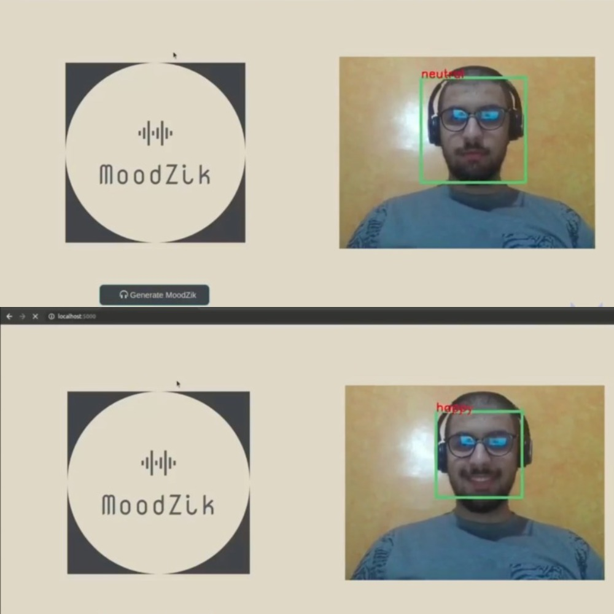
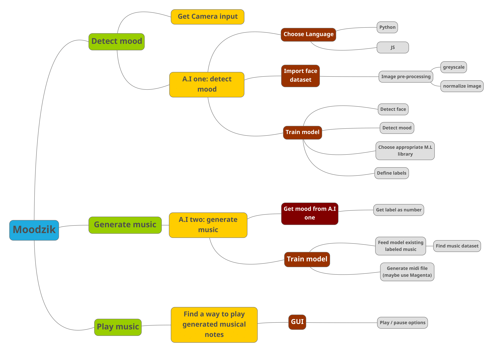

# Moodzik

### Overview:
MoodZik is a web app that utilizes Machine Learning to analyze a user's face through the webcam, identify their current emotions, and generate music from scratch based on how they are feeling.  
The technologies / libraries used in this project are:
- Tensorflow & Keras
- Convolutional Neural Networks (Face / Emotion detection)
- Recurrent Neural Networks (Music generation)
- Pandas
- OpenCV
- NumPy
- Flask

    
### Clone & Install dependencies:  
Moodzik builds fine on `Python 3.8.5` 
```
    git clone https://github.com/Belhoussine/Moodzik.git  
    ./Moodzik/setup
```

### Run Moodzik locally:
```
    cd ./Moodzik/WebApp/
    python3 app.py
    firefox http://127.0.0.1:5000/
```

## Face & Emotion Detection:


## MindMap:


## 1. Face detection CNN:
- [x] Get input from camera
- [x] Use Haar_Cascade model
- [x] Capture face:
    - [x] Capture frame
    - [x] Crop frame to identify face only
- [x] Process captured face
- [x] Feed to CNN_02

## 2. Mood detection CNN:
- [x] Get face image from CNN_01
- [x] Build CNN_02:
    - [x] Design network architecture:
        - [x] Convolution layers.
        - [x] Fully connected Neural Network.
        - [x] Define activation functions.
        - [x] Define output labels.
        - [x] Define optimizer / loss function.

- [x] Train CNN_02:
    - [x] Dataset:
        - [x] Pre-processing:   
            - [x] Normalize data
        - [x] Image processing:
            - [x] Convert to grayscale
    - [x] Train model
    - [x] Save model as JSON

- [x] Predict mood from image
- [x] Display mood

## 3. Music Generation RNN:
- [x] Get mood from CNN_02
- [x] Train Music generator Neural Network:
    - [x] Use Magenta
    - [x] Use primers to generate music from
- [x] Generate music based on mood:
    - [x] Provide mood primers
    - [x] Generate MIDI file based on mood

## 4. Play Music:
- [x] Use Pygame.mixer on generated midi file

## 5. Publish web-app:
- [x] Desing GUI
- [x] Use flask to serve app
- [ ] Host in a remote server
- [ ] Purchase domain name
- [ ] Deploy
