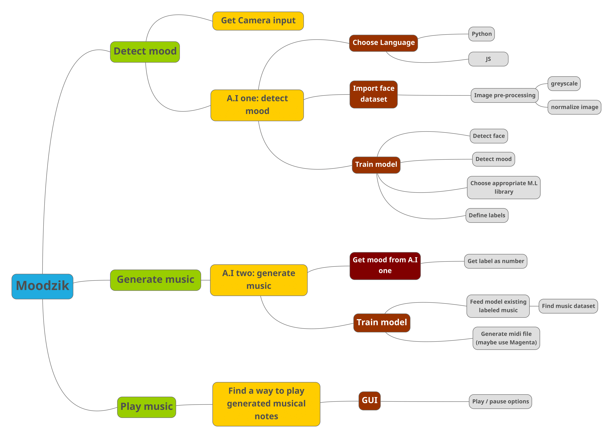

# Moodzik

## MindMap:

## 1. Face detection:
- [ ] Get input from camera
- [ ] Build / Train CNN_01:
    - [ ] Find face dataset
- [ ] Capture face:
    - [ ] Capture frame
    - [ ] Crop frame to identify face only
- [ ] Process captured face
- [ ] Feed to CNN_02

## 2. Mood detection:
- [ ] Get face image from CNN_01
- [x] Build CNN_02:
    - [x] Design network architecture:
        - [x] Convolution layers.
        - [x] Fully connected Neural Network.
        - [x] Define activation functions.
        - [x] Define output labels.
        - [x] Define optimizer / loss function.

- [x] Train CNN_02:
    - [x] Dataset:
        - [x] Pre-processing:   
            - [x] Normalize data
        - [x] Image processing:
            - [x] Convert to grayscale
    - [x] Train model
    - [x] Save model as JSON

- [ ] Predict mood from image

## 3. Music Generation:
- [ ] Get mood from CNN_02
- [ ] Train Music generator Neural Network:
    - [ ] Find music dataset
    - [ ] Feed music in ABC format
- [ ] Generate music based on mood:
    - [ ] Generate MIDI file based on mood

## 4. Play Music:
- [ ] Desing GUI
- [x] Use Pygame on generated midi file

## 5. Publish web-app:
- [ ] Use flask to serve app
- [ ] Host in a remote server
- [ ] Purchase domain name
- [ ] Deploy
